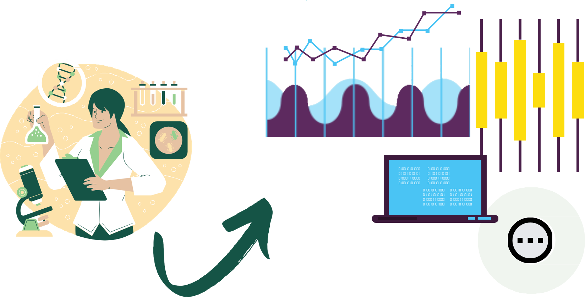
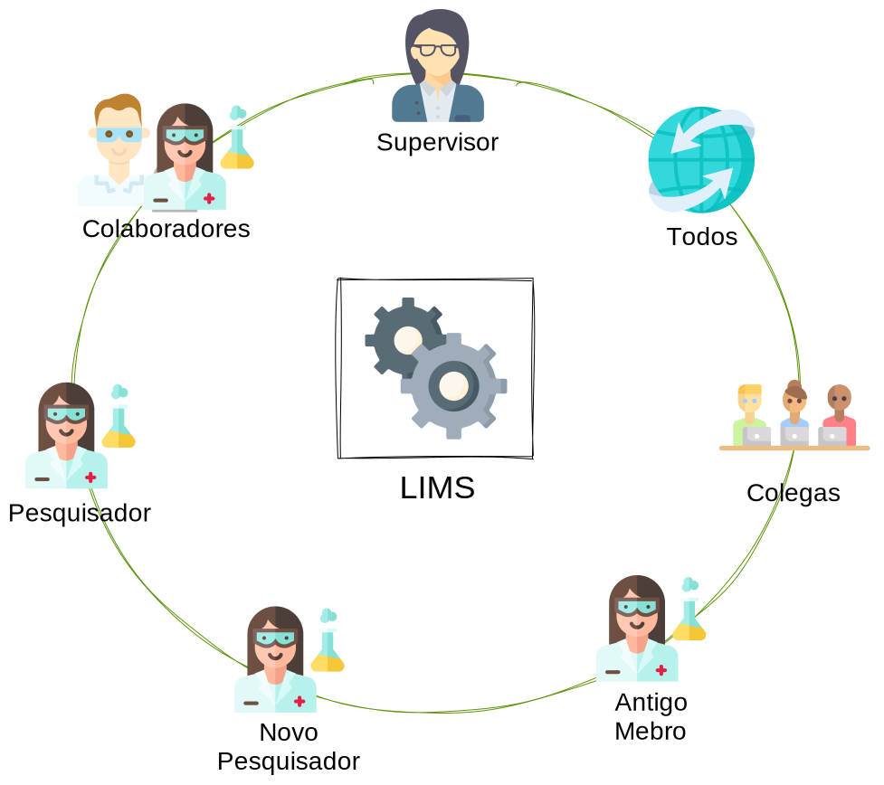
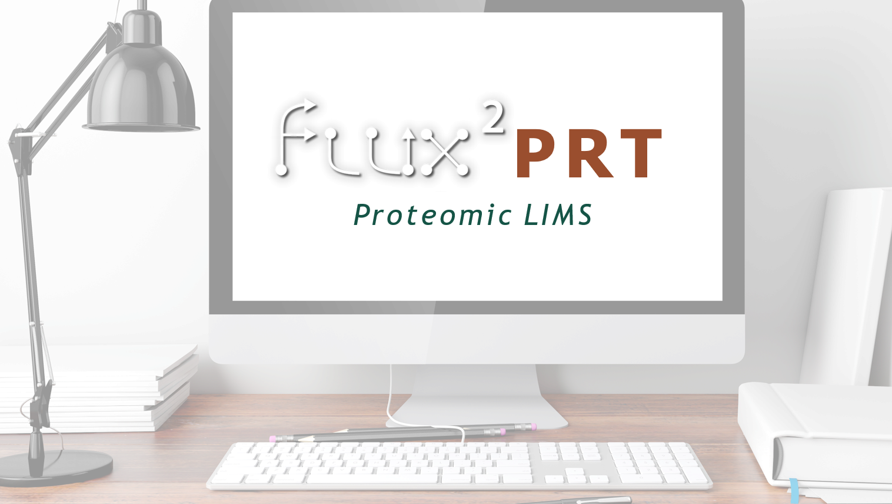
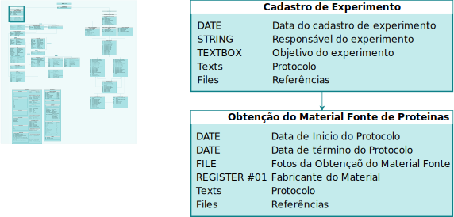
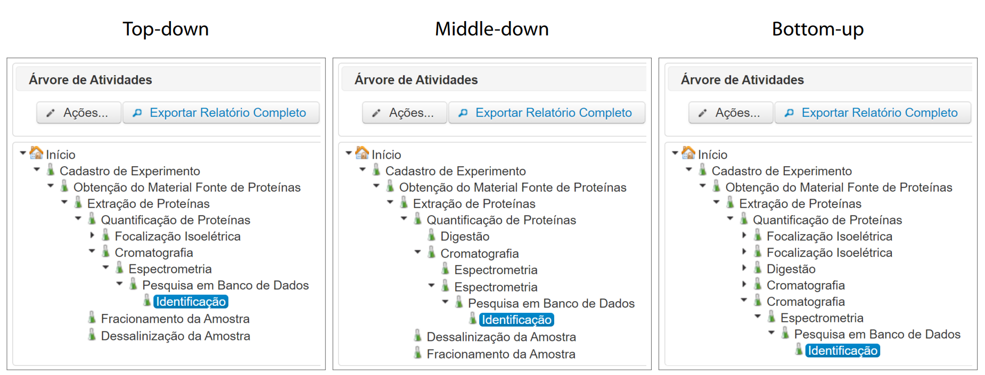
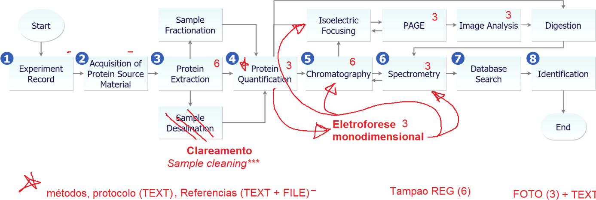
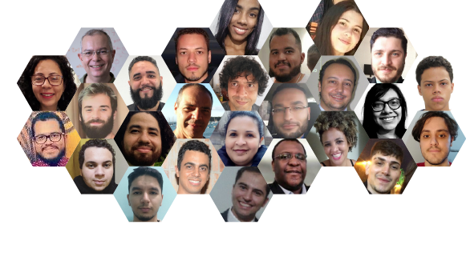

layout: true
  
<div class="my-footer"><span>
Seminários em Bioinformática 27/06/2022 - <a href="https://github.com/ElizaAlfaro">Elizabeth Alfaro-Espinoza</a>
</span></div>


---
class: middle
```{r setup, include=FALSE}
options(htmltools.dir.version = FALSE)

knitr::opts_chunk$set(echo = FALSE, fig.align = "center", message=FALSE, warning=FALSE, comment = "", cache = F, dev = "svg", fig.ext = "svg")
```

```{r include = FALSE}
library(knitr)
library(tidyverse)
library(widgetframe)
#library(checkdown)
```

```{r xaringanExtra, echo = FALSE}
# Add progress bar
xaringanExtra::use_progress_bar(color = "#0051BA", location = "top", height = "10px")

## Add clor styles for code
xaringanExtra::use_extra_styles(
  hover_code_line = TRUE,         #<<
  mute_unhighlighted_code = TRUE  #<<
)

## add scribble... Press S
xaringanExtra::use_scribble()

## add overview... Press O
xaringanExtra::use_tile_view()

#Editar na hora
xaringanExtra::use_editable(expires = 1)
```


```{r, out.width="100%"}

```

---
class: middle

```{r, out.width="100%"}
knitr::include_graphics("img/intro/introQ.png")
```

---
class: middle

```{r, out.width="100%"}
knitr::include_graphics("img/intro/limsFluxPRT.png")
```

---
class: middle

.left-column[ 

# LIMS
`r emo::ji("no_entry")` Papelada

`r emo::ji("no_entry")` Custo tempo

`r emo::ji("mag")` Resultados

`r emo::ji("mag")` Amostras

`r emo::ji("point_right")` Relatórios

`r emo::ji("dart")` Trabalho do lab

<br><br><br>

```{r, out.width="100%",fig.align='left'}
knitr::include_graphics("visual_citations/Higgins_2022.png")
```
]

.right-column[ 
```{r, out.width="80%", fig.align='center', fig.cap="Adaptado de Higgins, Nogiwa-Valdez e Stevens (2022). "}

```
]

---
class: middle

```{r, out.width="90%", fig.cap="Integração de ferramentas e métodos de proteómica em um sistema."}

```

---
class: middle

# Objetivos Específicos
<br>

### <center>FluxPRT: <i>"Integração de ferramentas e métodos de proteómica em um sistema"</i><br><br></center>

|Workflow complexos|Compartilhar dados|Rastreabilidade|Análise de dados|Geração de relatórios|
|:-:|:-:|:-:|:-:|:-:|
||||||

.pull-right[
*Fonte: <a href="https://www.flaticon.com/free-icons/share" title="share icons">Freepik - Flaticon</a>. Licença CC Atrib.*
]

---
class: middle

# Desenvolvimento do FluxPRT

```{r, out.width="90%",fig.align='center',fig.cap="<i>Fluxo do desenvolvimento do sistema. Fonte: Autoral, usando icones do Freepik - Flaticon.</i>"}
knitr::include_graphics("img/metod/metodologia.svg")
```

---
class: middle

# Especificação
<center><br><h4>Atividade: Conjunto de atributos. Pode ter conexões de precedência.</h4><br></center>

```{r, out.width="70%",fig.align='center',fig.cap="<i>Especificação da versão atual. Fonte: Autoral.</i>"}

```

---
class: middle

# Protótipo dev

```{r, out.width="100%",fig.align='center',fig.cap="<i>Versão atual do FluxPRT. Fonte: Autoral.</i>"}
knitr::include_graphics("img/metod/prototipo.png")
```

---
class: middle


```{r, out.width="60%",fig.align='left'}
knitr::include_graphics("visual_citations/Alfaro-Espinoza_2021.png")
```


```{r, out.width="100%"}
knitr::include_graphics("img/result/fluxoAtivbr.svg")
```


```
--- http://www.flux2.luar.dcc.ufmg.br
--- guest2021: gu3st
```

---
class: middle
## FluxPRT

```{r echo=FALSE}
xaringanExtra::embed_xaringan(
  url = "http://www.flux2.luar.dcc.ufmg.br",
  ratio = "16:7"
)
```

---
class: middle

## Documentação

.left-column[ 
`r emo::ji("pushpin")` Sistema Flux

`r emo::ji("pushpin")`  Específ. do FluxPRT


```
--- https://fluxprt.github.io
```
]

.right-column[ 
```{r, out.width="96%", fig.align='right'}
knitr::include_graphics("img/result/documentacao.gif")
```
]


---
class: middle
## Documentação específica do FluxPRT

```{r echo=FALSE}
xaringanExtra::embed_xaringan(
  url = "https://fluxprt.github.io",
  ratio = "16:7"
)
```

---
class: middle

## Diferentes enfoques de trabalho

```{r, out.width="100%", fig.cap="<center><i>Interação entre o sistema Flux e o Guia Interativo. Fonte: Alfaro-Espinoza et. al. (2021).</i></center>"}

```

---
class: middle

# Testes
<center><iframe width="940" height="450" src="https://www.youtube.com/embed/2lwmWPjRnDk?start=8" frameborder="0" allow="accelerometer; autoplay; clipboard-write; encrypted-media; gyroscope; picture-in-picture" allowfullscreen></iframe></center>

---
class: middle

# Feedback

<center><br><h4>Moficações nas atividades e atributos</h4><br><br></center>

```{r, out.width="100%", fig.cap="<center><i>Atividades do FluxPRT. Fonte: Autoral.</i></center>"}

```

---
class: middle

# Feedback incorporado

<center><br><h4>15 atividades</h4><br><br><br></center>

```{r, out.width="100%", fig.cap="<center><i>Atividades do FluxPRT. Fonte: Autoral.</i></center>"}
knitr::include_graphics("img/result/fluxoAtivTestes.svg")
```

---
class: middle

# Relatório

```{r}
xaringanExtra::embed_xaringan("https://github.com/ElizaAlfaro", max_width = "80%")
```

---
class: middle


# FluxPRT
<br>

|Flexível|Adaptável|Rastreamento|Relatórios|Suporte|Gratuito (*)|
|:-:|:-:|:-:|:-:|:-:|:-:|
|||||||
|Mudar o fluxo| Diferentes enfoques|Acompanhamento da Amostra|Compartilhar dados|Cada membro|Labs com poucos recursos|

.pull-right[
*Fonte: <a href="https://www.flaticon.com/free-icons/share" title="share icons">Freepik - Flaticon</a>. Licença CC Atrib.*
]

---


class: middle

# Próximos Passos

<br>

|Workflows complexos|Estándares internacionais|Guia Interativo|Versão inglês|Análise de dados|
|:-:|:-:|:-:|:-:|:-:|:-:|
||||||
|Cada membro|MIAPE, BPL, ISO17904|Todas as atividades|Workflow e Guia Interivo|Integrar ferramentas|


.pull-right[
*Fonte: <a href="https://www.flaticon.com/free-icons/share" title="share icons">Freepik - Flaticon</a>. Licença CC Atrib.*
]

---

class: middle

# ¡Muito obrigada!
.pull-left[

```{r, out.width="100%"}
knitr::include_graphics("img/thanks.png")
```
]


.pull-right[
**Agradecimientos especiais**:
- Sérgio Campos.
- Alessandra Campos
- Equipe LUAR
- Membros LPBP - UFV
- Secretaria do PPG Bioinformática
- Bolsa CAPES 88887.517813/2020-00
]


**Contato**:
- Email: <a href="mailto:elizaespinoza@ufmg.br">elizaespinoza@ufmg.br</a>
- Github: <a href="https://github.com/ElizaAlfaro">@elizaAlfaro</a>
- Twitter: <a href="http://twitter.com/elizabioinfo">@elizabioinfo</a>


.pull-right[
*Feito com `r emo::ji("blue_heart")` usando [Xaringan](https://github.com/yihui/xaringan) e [Kunoichi](https://github.com/emitanaka/ninja-theme).*
]

xaringan::inf_mr()

---
class: inverse, middle

#Equipe LUAR

```{r, out.width="100%"}

```

---
class: middle
## Referências


```{r, out.width="50%",fig.align='left'}
knitr::include_graphics("visual_citations/Alfaro-Espinoza_2021.png")
```

```{r, out.width="50%",fig.align='right'}
knitr::include_graphics("visual_citations/Higgins_2022.png")
```

